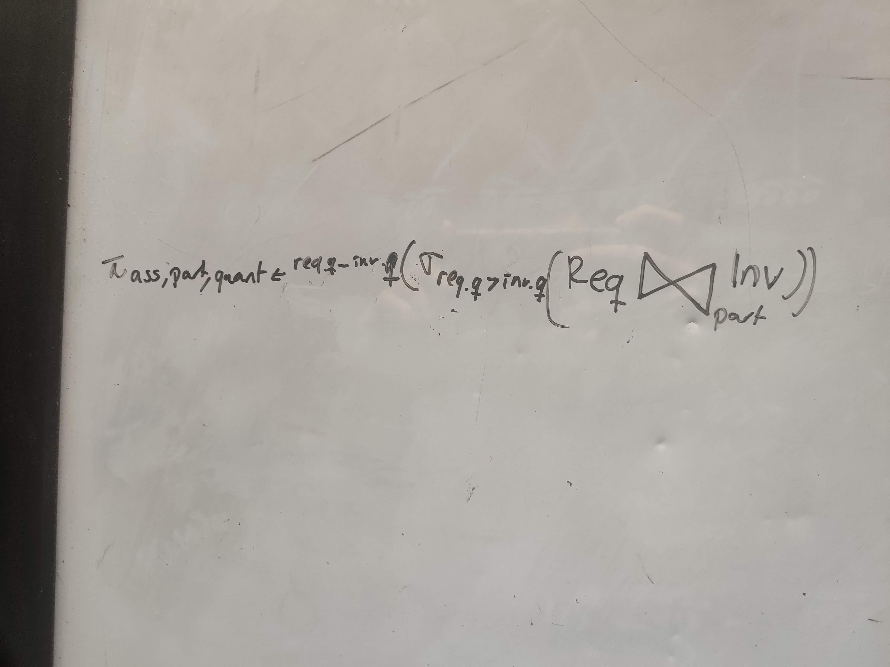

### 1. Install llama3.1 with 8B on your machine via visiting ollama.com Länkar till en extern sida. and launch a chat via: ollama run llama3.1

```bash
ollama serve
ollama run llama3.1
```

### 2. Define a view for Needs_Part from slide 3 of lecture 7. You may use the view Can_Make in your view definition. Note that Needs_Part says exactly what you need to add to inventory to enable the building of an assembly.


assuming that every item is in inventory with quantity 0 or more.



```sql
CREATE VIEW Needs_Part AS SELECT Requires.assembly assembly, Requires.part part, (Requires.quantity - Inventory.quantity) quantity 
    from Requires INNER JOIN Inventory on Requires.part = Inventory.part 
    WHERE Requires.quantity > Inventory.quantity; 
```

### 3. Come up with a problem to add to the nine that were proposed in lecture 7. 

Influenced on problem 1 we might want to prioritize the people that are contacting customer support and are negative as these might to escalate quickly and we do not want to loose customers. The prioritization can be made by sentimental analysis of their message.

### 4. The program chat.py  chat.py has a bad prompt that does not result in good chat. Fix it so that it better supports chat. 
```Python
    template="""<Start of old chat history>\n{history}\n<end of old chat history>\n{utterance}""",

    history = history + "\n" + utterance+"\n" + response + "\n"
```

### 5. Using dealership.py  dealership.py and vectorDB.py  vectorDB.py as a starting point, develop a routing example where you have 50 sentences of one type, 50 of another and 50 of a final type. Pick a domain that interests you and experient with getting the best accuracy you can. 

Prompt to GPT:
>Imagine that you are a student taking a database course at KTH. The course consists of two parts: Homeworks(database modelling, normal forms, ER-diagrams, relational algebra) and labs (SQL commands, aggregations, connecting to python). Come up with 50 questions that you might need to ask a TA for each category and also 50 admin questions that you could ask the course coordinator. Save all the questions in 3 python lists.

### 6. Develop your own set of pages you want to index based on documents.py  documents.py and extend rag.py  rag.py to include a persistent vector store.

Done

### 7. Develop your own set of pages you want to index based on documents.py  documents.py and extend rag.py  rag.py to include a persistent vector store.

Skatteverket english pages about inkomstdeklaration

### 8. Based on your solution to 7 and your reading of the RAG survey paper, describe some extensions you could make to 7's retrieval mechanism.

It is very important that the information is up to date, as some money sums is updated each year, so to add some sort of metadata of when it was last updated would be useful. How the chunks are generated will also influence the result, to not loose information between two chunks, some sort of sliding window approach could be used.

### 9. Based on your solution to 7 and your reading of the RAG survey paper, describe some extensions you could make to 7's generation mechanism.

Both the chunks and queries can be modified. The chunks can be edited so the most important information in each chunk is either in the beginning or end as it is there were the LLM has most focus by for example moving all money amounts to the beginning. The user query can also be cleaned up when it is tokenized to remove unnecessary words which otherwise would just become noise.

### 10. Based on your solution to 7 and your reading of the RAG survey paper, describe some extensions you could make to 7's augmentation mechanism.

The answer can be gradually built up by either splitting the question into smaller questions that are recursively sent to the RAG (good when asking a complex question that involves many smaller questions, eg. "Do i need to declare and if so when?") or by asking the same question multiple time to the RAG until a satisfactory answer has been generated.